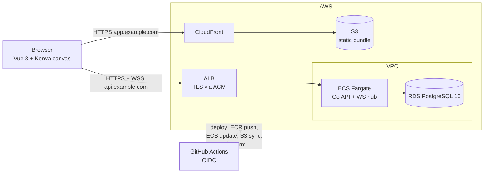
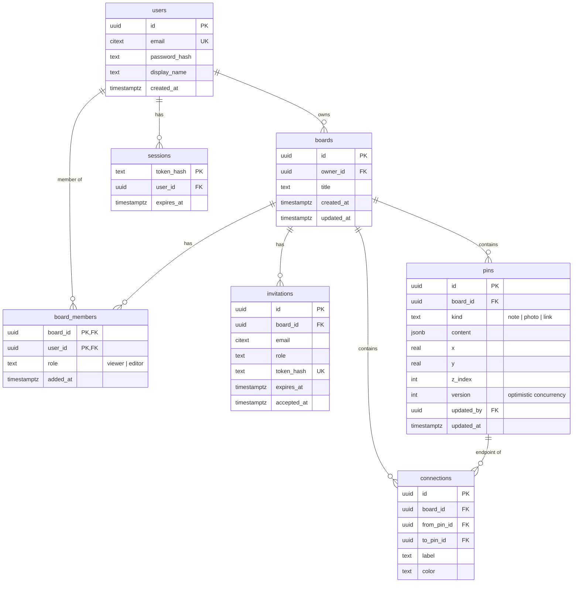
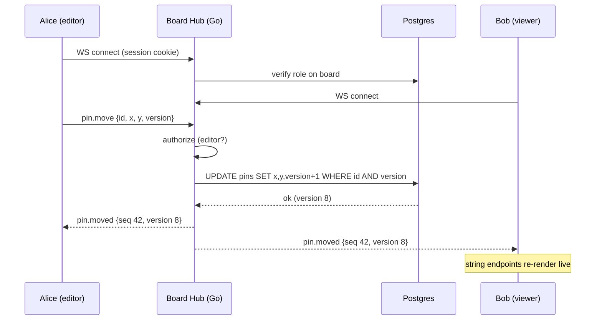
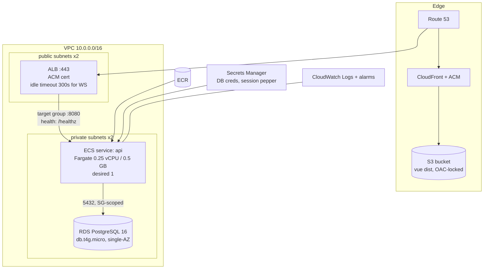
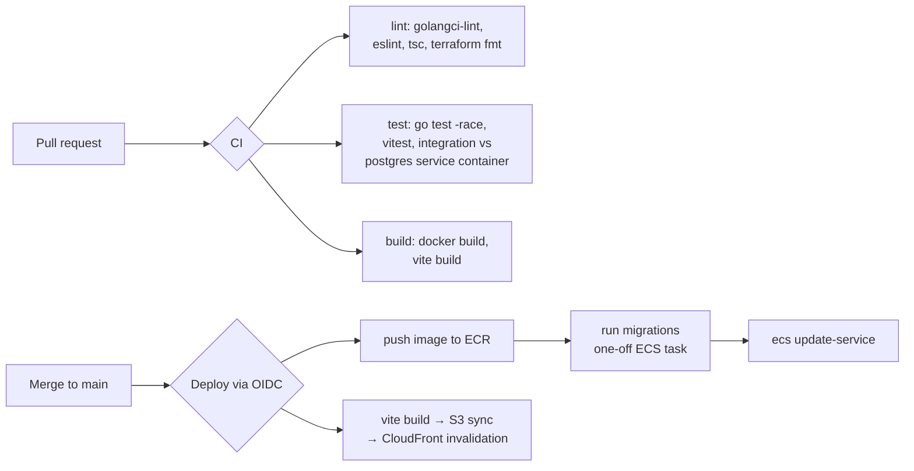

# Conspiracy Board — Architecture

A collaborative "cork board" web app: users pin clues to boards and connect them with strings, in real time, with other invited users. Personal project built to enterprise standards for portfolio purposes.

**Status:** Approved design, pre-implementation
**Date:** 2026-07-23

---

## 1. Goals & Constraints

**Product requirements**

- Account creation and authentication
- Dashboard listing a user's boards (owned and shared)
- Board canvas: draggable pins ("clues"), string connections between pins
- Sharing: owner invites users; **viewer** (read) by default, upgradeable to **editor** (write)
- Real-time collaboration: edits by one user appear live for others on the same board

**Non-functional goals**

- Demonstrate enterprise practices: IaC, CI/CD, secure auth, observability, tested code
- Low steady-state cost (personal project) without architectural compromises
- Local dev experience with Docker Compose, matching production behavior

---

## 2. Stack Summary

| Layer | Choice | Replaces / Notes |
|---|---|---|
| Frontend | Vue 3 + TypeScript + Pinia + Vite | Konva.js (via `vue-konva`) for the board canvas |
| API | **Go 1.22+** — chi router, pgx, sqlc, golang-migrate | Replaces Python; single binary, ~15 MB image |
| Real-time | WebSockets (`coder/websocket`), in-process hub per board | Redis pub/sub seam for multi-instance (deferred) |
| Database | PostgreSQL 16 (RDS db.t4g.micro) | JSONB for pin content |
| Auth | Cookie sessions, Argon2id hashing | Self-implemented (see ADR-3) |
| Frontend hosting | S3 + CloudFront | Replaces the Nginx container in production |
| API hosting | ECS Fargate behind an ALB | |
| IaC | Terraform | |
| CI/CD | GitHub Actions with AWS OIDC | No long-lived AWS keys |
| Local dev | Docker Compose (api, postgres, nginx, vite) | Nginx retained locally only |

---

## 3. Key Decisions (ADR summaries)

### ADR-1: Go for the API — accepted

Your instinct is right, and this project is an unusually good fit for Go. The real-time layer is the reason: each WebSocket connection is a cheap goroutine, and the per-board hub (fan-in of edits, fan-out of events) is idiomatic Go — channels and a `select` loop, no async framework required. Secondary wins: a single static binary makes tiny containers and fast Fargate cold starts; `sqlc` generates type-safe query code from real SQL, which reads well in a portfolio; and shipping Go alongside your existing Python history shows range.

Trade-off: slower to write than FastAPI, more boilerplate for validation/serialization. Accepted — learning Go is an explicit goal.

Library choices, deliberately minimal (a portfolio signal in Go culture): **chi** for routing (stdlib-compatible, middleware ecosystem), **pgx** driver, **sqlc** for query codegen, **golang-migrate** for schema migrations, **slog** (stdlib) for structured JSON logs.

### ADR-2: Drop Nginx from production; S3 + CloudFront for the frontend — accepted

In your previous setup Nginx did TLS termination, static file serving, and reverse proxying. On ECS all three jobs are better handled by managed services: the **ALB** terminates TLS (ACM certificate) and routes to the API; **S3 + CloudFront** serves the built Vue bundle globally with cache headers, for pennies. Running an Nginx sidecar on Fargate would cost more and add a container with no distinct job. Nginx stays in local Compose to preserve same-origin behavior in dev.

### ADR-3: Self-implemented cookie sessions over Cognito/Auth0 — accepted

For a portfolio, correctly implementing auth demonstrates more than configuring a managed provider: Argon2id password hashing, opaque session tokens in an `HttpOnly; Secure; SameSite=Lax` cookie, server-side session store (Postgres table) with sliding expiry, and CSRF protection via double-submit token on mutating routes. Sessions (vs stateless JWTs) allow instant revocation and are the simpler-to-get-right option. Cognito remains a documented alternative if scope grows (OAuth social login, MFA).

### ADR-4: Server-authoritative real-time with a per-board hub — accepted

Full CRDT/OT sync (à la Figma) is out of scope; a conspiracy board doesn't need character-level merging. Instead: the server is the source of truth, clients send intent events over WebSocket, the server validates permissions, persists, and broadcasts the canonical event to all subscribers of that board. Conflicts on pins use last-write-wins with a `version` column; concurrent moves of the *same* pin are rare and low-stakes.

**Scaling seam:** an in-process hub only works while one API task runs. The broadcast interface is defined so a Redis pub/sub implementation can drop in when task count > 1 (ALB does not route WebSocket peers to the same task). Documented, not built — cost stays at zero until needed. See §6.

### ADR-5: ECS Fargate + Terraform — accepted

Chosen over single-EC2 Compose for the enterprise story: task definitions, service auto-recovery, ALB health checks, zero-SSH deploys, and everything expressed in Terraform. Estimated steady-state cost ~$35–55/mo (ALB ~$18, Fargate 0.25 vCPU/0.5 GB ~$9, RDS t4g.micro ~$12, CloudFront/S3/ECR ~$2). A `terraform destroy`/`apply` cycle can park the environment between demo periods.

### ADR-6: Opt-in ephemeral preview environments per branch — accepted

Pushing a branch named `preview/<name>` deploys a live test environment at `https://<name>.preview.<domain>`; deleting the branch tears it down, and a nightly sweep destroys any preview whose branch has disappeared (webhooks can be missed, and forgotten previews cost real money).

**Opt-in by branch prefix, not automatic.** Deploying every branch would run a Fargate task (~$9/mo) per open branch and add minutes to every push. The prefix makes preview creation a deliberate act, requires no PR to exist, and needs zero extra tooling — the workflow's `on: push: branches: ["preview/**"]` filter is the whole mechanism. (The common alternative — deploy on PR open with a `preview` label — is better for team review workflows; for a solo project the prefix is less ceremony.)

**Previews are single-container.** The preview image embeds the built Vue bundle in the Go binary (`SERVE_STATIC=1`), so one Fargate task serves both UI and API. This avoids per-preview CloudFront distributions (slow to create, awkward to tear down) and keeps a preview to: one ECS service, one ALB host-header rule, one Route 53 record, one database. Production keeps the S3 + CloudFront split; the divergence is confined to static-file serving and is worth the operational simplicity.

**Shared infrastructure, isolated state.** Previews reuse the production VPC, ALB (host rules on the existing HTTPS listener under a `*.preview.<domain>` wildcard cert), ECS cluster, and RDS instance (each preview gets its own database, `preview_<slug>`). Each preview is a Terraform workspace, so `destroy` removes exactly one preview. Marginal cost per preview is the Fargate task only.

**Naming:** branch names are sanitized to DNS-safe slugs (lowercase, alphanumeric + dashes, ≤30 chars) — `preview/JIRA-42_fix` → `jira-42-fix.preview.<domain>`.

---

## 4. System Context



---

## 5. Data Model



Notes: the board **owner** is not duplicated into `board_members` — authorization checks `owner_id` first, then membership. `pins.content` is JSONB so pin kinds can evolve (note text, image URL + crop, link + preview) without migrations. `connections` carries a `CHECK (from_pin_id <> to_pin_id)` and a unique index on the pin pair. All child tables cascade on board delete. Deleting a pin cascades its connections.

**Authorization matrix**

| Action | Viewer | Editor | Owner |
|---|---|---|---|
| View board, subscribe to live updates | ✓ | ✓ | ✓ |
| Create/move/edit/delete pins & strings | | ✓ | ✓ |
| Rename board | | | ✓ |
| Invite members / change roles / remove members | | | ✓ |
| Delete board | | | ✓ |

---

## 6. API & Real-Time Design

### REST (JSON, `/api/v1`)

```
POST   /auth/register            POST   /auth/login         POST /auth/logout
GET    /me
GET    /boards                   POST   /boards
GET    /boards/{id}              PATCH  /boards/{id}        DELETE /boards/{id}
GET    /boards/{id}/members      PATCH  /boards/{id}/members/{userId}   DELETE .../members/{userId}
POST   /boards/{id}/invitations  POST   /invitations/{token}/accept
POST   /boards/{id}/pins         PATCH  /boards/{id}/pins/{pinId}       DELETE .../pins/{pinId}
POST   /boards/{id}/connections  DELETE /boards/{id}/connections/{connId}
GET    /healthz                  GET    /readyz
```

`GET /boards/{id}` returns the full board snapshot (board, members, pins, connections) plus a monotonically increasing `seq` — the client's sync starting point.

### WebSocket: `GET /api/v1/boards/{id}/ws`

Authenticated by the same session cookie. The server validates board access on upgrade, then registers the connection with that board's hub.

**Server→client events:** `pin.created`, `pin.updated`, `pin.moved`, `pin.deleted`, `connection.created`, `connection.deleted`, `member.updated`, `presence.state`, `cursor.moved`. Every persistent event carries `seq`; on reconnect the client sends `last_seq` and the server replays from a short in-memory ring buffer, or instructs a full snapshot re-fetch.

**Client→server events:** the same mutations (validated against role), plus `cursor.moved` (throttled ~30/s, presence-only, never persisted). Pin drags stream as `cursor`-style ephemeral moves and commit as one `pin.moved` on drop — keeps the DB write rate sane.



**Hub structure:** one goroutine per board holds the subscriber set and the ring buffer, fed by a channel; connections have per-client buffered send channels (slow consumers are dropped, they reconnect and resync). The hub writes through a `Broadcaster` interface; `LocalBroadcaster` now, `RedisBroadcaster` (ElastiCache, pub/sub channel per board) when the service scales past one task.

### Frontend structure

Vue 3 + Pinia. The board page owns a `BoardStore` that holds the snapshot, applies WS events (idempotent by `seq`), and performs optimistic local mutations rolled back on server rejection. Konva stage handles pan/zoom (scale-limited), pin drag, and draws strings as bezier `Line` nodes bound to pin positions — moving a pin re-renders its strings for free. Cursor presence renders as named colored dots.

---

## 7. AWS Deployment Topology



Security posture worth calling out in the portfolio: API tasks and RDS live in private subnets; security groups chain ALB→API→RDS with no broader ingress; S3 is not public (CloudFront Origin Access Control); secrets are injected from Secrets Manager into the task definition, never baked into images; deploys authenticate via GitHub OIDC federation with a role scoped to the repo — zero stored AWS credentials.

Cost levers: single-AZ RDS and desired-count 1 are deliberate dev-tier choices; the Terraform variables (`instance_class`, `desired_count`, `multi_az`) show you know what production would change. NAT gateway is avoided by using VPC endpoints for ECR/Logs/Secrets (or a public-subnet task with a strict SG as the cheaper fallback — pick one and document it).

## 8. CI/CD



Migrations run as a one-off ECS task (same image, `migrate` entrypoint) *before* the service update, so a task that boots always sees a compatible schema. Terraform runs in a separate manually-approved workflow (`plan` on PR, `apply` on approval).

**Local dev:** Compose with `postgres:16`, the Go API (Air for hot reload), Vite dev server, and Nginx in front so cookies/paths behave same-origin as production.

## 9. Observability & Testing

Structured JSON logs via `slog` with request IDs (middleware) flow to CloudWatch; alarms on ALB 5xx rate and unhealthy-host count. `/healthz` is liveness, `/readyz` checks a DB ping. Add OpenTelemetry traces later if desired — the chi/pgx ecosystem makes it a small diff.

Testing pyramid: `go test -race` unit tests on the hub (table-driven — concurrency correctness here is the flagship test suite), sqlc-backed integration tests against a real Postgres container, a WS integration test driving two clients through a move-and-observe scenario, Vitest for the Pinia store's event application, and one Playwright smoke (register → create board → pin → connect) run in CI.

## 10. Build Order

1. **Foundation** — repo layout (single monorepo: `/api`, `/web`, `/infra`, `/.github`), Compose, migrations, healthz, CI skeleton
2. **Auth & boards** — register/login/sessions, CSRF, dashboard CRUD
3. **Board canvas (REST only)** — Konva canvas, pins, strings, optimistic updates
4. **Real-time** — hub, WS endpoint, event protocol, reconnect/resync
5. **Sharing** — invitations, roles, authorization matrix enforcement
6. **AWS** — Terraform modules, OIDC deploy pipeline, CloudFront/S3, alarms
7. **Polish** — presence cursors, pin kinds (photo/link), Playwright smoke, README with these diagrams

Steps 3→4 are ordered so the REST layer is proven before layering the WS protocol on the same handlers' service layer — mutations share one code path regardless of transport.
